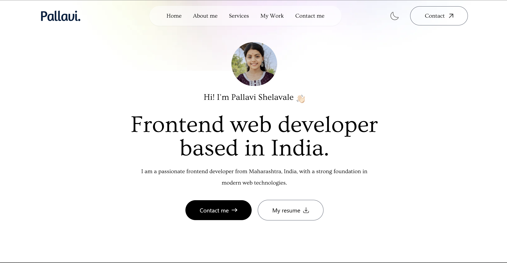
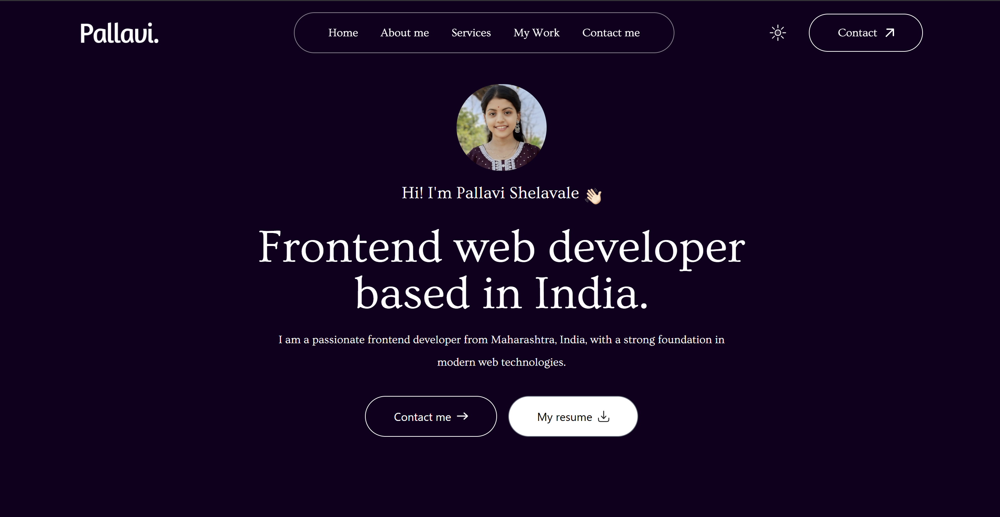

# 📁 Portfolio Website  

## 👩‍💻 About  
This is my personal **portfolio website** built using **HTML, JavaScript, and Tailwind CSS**. It showcases my projects, skills, education, and contact details. The website is fully responsive and designed to help recruiters and clients understand my work and experience

## 📸 Screenshots ✨

### 🏠 Home Page (Light Mode)

### 🏠 Home Page (Dark Mode)

---

## 🚀 Tech Stack  
- ✅ HTML5
- ✅ Tailwind CSS  
- ✅ JavaScript  
- ✅ Git & GitHub  

---

## 🌐 Live Demo  
👉 [Click here to view the live website!](https://shelavalepallavi.github.io/)  

---

## 📸 Features  
✨ Interactive & responsive design
✨ Smooth scrolling navigation
✨ Home page introduction with a friendly welcome
✨ Detailed about section 
✨ Skill set and technologies displayed with icons or progress bars  
✨ Projects showcase with links to GitHub repositories and  Live deployed projects
✨ Education   
✨ Contact form that allows easy reach-out  
✨ Mobile-friendly layout 

📧 Contact

📩 Email: pallavishelavale3795@gmail.com

🔗 LinkedIn: https://www.linkedin.com/in/pallavi-shelavale-5a5540333

💻 GitHub: https://github.com/shelavalepallavi
